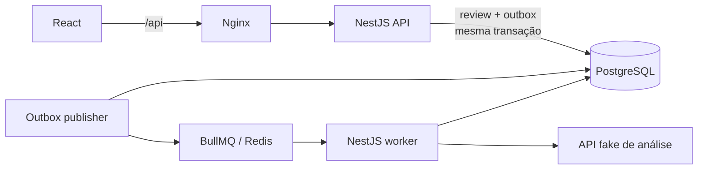

# Falaê! — Processamento resiliente de avaliações

Aplicação full stack para receber avaliações sem depender da disponibilidade do
serviço externo de análise. A API persiste o feedback e responde imediatamente;
o processamento acontece em segundo plano e seu resultado pode ser acompanhado
pela interface.

## Executar o projeto

O único requisito é ter Docker com Docker Compose disponível.

```bash
docker compose up --build
```

Na primeira execução, o Docker instala as dependências, constrói as imagens,
inicia a infraestrutura e aplica as migrations automaticamente. Quando os
healthchecks estiverem saudáveis, acesse:

| Serviço | Endereço |
| --- | --- |
| Interface web | http://localhost:3000 |
| API | http://localhost:3001 |
| Swagger | http://localhost:3001/docs |
| API fake de análise | http://localhost:4000 |

Não é obrigatório criar um `.env`: o Compose possui valores locais seguros por
padrão. Para alterar portas, credenciais ou a política de retry:

```bash
cp .env.example .env
docker compose up --build
```

Para acompanhar o processamento:

```bash
docker compose logs -f api worker
```

Para encerrar os containers preservando os dados:

```bash
docker compose down
```

Para também apagar os volumes do PostgreSQL e Redis:

```bash
docker compose down --volumes
```

> O serviço `migrate` terminar com código `0` é o comportamento esperado: ele
> aplica as migrations uma vez e libera a inicialização da API e do worker.

## Arquitetura



O repositório usa npm workspaces:

```text
apps/
  api/       API HTTP NestJS
  web/       interface React + Vite
  worker/    publicação do outbox e processamento BullMQ
packages/
  contracts/ tipos compartilhados entre frontend e backend
  database/  schema, migrations e cliente Prisma
mock-analysis-api/
  serviço externo simulado fornecido no desafio
```

### Fluxo de uma avaliação

1. `POST /reviews` valida o payload e a chave de idempotência.
2. A avaliação e seu evento de outbox são gravados na mesma transação.
3. A API responde `202 Accepted`, sem aguardar a análise.
4. O publisher consulta o outbox e publica um job no Redis.
5. O worker altera o status para `processing` e chama a API fake.
6. Sucesso, erro e número de tentativas são persistidos no PostgreSQL.
7. A interface atualiza automaticamente a lista enquanto houver itens ativos.

## Decisões de confiabilidade

### Idempotência

O header `Idempotency-Key` é obrigatório e deve ser igual a `external_id`. A
unicidade de `(company_id, external_id)` também é garantida pelo PostgreSQL, não
apenas pela aplicação.

- Repetir a mesma avaliação retorna o registro existente e `duplicate: true`.
- Reutilizar a chave com conteúdo diferente retorna `409 Conflict`.
- A criação inicial e seu evento de outbox acontecem uma única vez na mesma
  transação; reprocessamentos explícitos geram eventos independentes.

### Transactional outbox

Persistir a avaliação e publicar diretamente no Redis deixaria uma janela de
falha entre essas duas operações. Por isso, a API grava `review` e
`outbox_event` atomicamente no PostgreSQL.

O publisher:

- procura eventos a cada segundo, em lotes de até 20;
- usa `FOR UPDATE SKIP LOCKED`, permitindo mais de uma instância sem publicar o
  mesmo lote simultaneamente;
- aplica um lease de 30 segundos, para que um evento volte a ficar disponível se
  o processo cair durante a publicação;
- usa o ID do evento de outbox como `jobId` no BullMQ, tornando a republicação
  do mesmo evento idempotente e permitindo reprocessamentos posteriores;
- registra tentativas e último erro do outbox.

Essa combinação cobre inclusive a falha entre adicionar o job no Redis e marcar
o evento como publicado.

### Timeout e retries

Por padrão, cada chamada à API fake possui timeout de 5 segundos e no máximo
quatro tentativas.

São considerados temporários:

- timeout e falhas de rede;
- HTTP `408`;
- HTTP `429`;
- HTTP `5xx`;
- respostas que indiquem explicitamente `retryable: true`.

O worker respeita `Retry-After` quando presente. Caso contrário, usa backoff
exponencial de 1, 2, 4… segundos, limitado a 30 segundos. Erros não temporários
interrompem as tentativas imediatamente. Ao esgotar a política, a avaliação fica
como `failed`, com `attempts`, `last_error` e `processed_at` persistidos. Jobs
falhos permanecem no Redis para inspeção.

### Estados visíveis

Os estados persistidos são `pending`, `processing`, `completed` e `failed`. A
interface diferencia cada um, permite atualização manual e faz polling a cada
três segundos somente enquanto existirem avaliações pendentes ou em
processamento. Isso mantém a experiência simples sem introduzir a complexidade
operacional de WebSocket ou SSE neste recorte.

## API

O contrato completo e interativo está disponível no Swagger em
http://localhost:3001/docs.

| Método | Rota | Descrição |
| --- | --- | --- |
| `POST` | `/reviews` | Persiste e agenda uma avaliação |
| `POST` | `/reviews/:id/reprocess` | Reagenda uma avaliação com status `failed` |
| `GET` | `/reviews` | Lista avaliações com paginação e filtro por status |
| `GET` | `/reviews/:id` | Retorna avaliação, análise e último erro |
| `GET` | `/health` | Healthcheck da API |

### Criar uma avaliação

```bash
curl --request POST http://localhost:3001/reviews \
  --header "Content-Type: application/json" \
  --header "Idempotency-Key: review-order-123" \
  --data '{
    "external_id": "review-order-123",
    "company_id": "company-456",
    "rating": 2,
    "comment": "O pedido demorou muito e chegou frio."
  }'
```

Resposta:

```json
{
  "id": "0d952735-bdd3-4a78-9260-2a26765fc654",
  "external_id": "review-order-123",
  "status": "pending",
  "duplicate": false
}
```

### Listar e filtrar

```bash
curl "http://localhost:3001/reviews?page=1&limit=20&status=completed"
```

Parâmetros aceitos:

- `page`: inteiro a partir de 1;
- `limit`: entre 1 e 100;
- `status`: `pending`, `processing`, `completed` ou `failed`.

### Reprocessar uma falha

Somente avaliações com status `failed` podem ser reprocessadas. A operação
responde imediatamente com `202 Accepted`; um novo evento é gravado no outbox e
o processamento continua de forma assíncrona.

```bash
curl --request POST \
  http://localhost:3001/reviews/0d952735-bdd3-4a78-9260-2a26765fc654/reprocess
```

Se a avaliação não estiver mais em `failed`, a API responde `409 Conflict`.

## Tecnologias

| Área | Escolha |
| --- | --- |
| Frontend | React 19, TypeScript, Vite e Testing Library |
| API | NestJS 11, TypeScript, class-validator e Swagger |
| Worker | NestJS, BullMQ e cliente HTTP nativo (`fetch`) |
| Persistência | PostgreSQL 17 e Prisma 7 |
| Fila | Redis 8 |
| Entrega | Docker Compose, imagens multi-stage e Nginx |
| Qualidade | Jest, Vitest, ESLint e Prettier |

NestJS foi escolhido pela familiaridade e por oferecer estrutura e injeção de
dependências úteis para API e worker sem exigir camadas artificiais. API e worker
são processos separados, mas compartilham contratos e acesso ao banco pelo
monorepo.

## Testes e qualidade

Com Node.js 24 e npm 11 instalados:

```bash
npm install
npm test
npm run typecheck
npm run lint
npm run format:check
npm run build
```

A suíte automatizada cobre, entre outros cenários:

- criação e duplicidade idempotente;
- conflito ao reutilizar uma chave com conteúdo diferente;
- validação do contrato, listagem, filtro e detalhe;
- sucesso e erros temporários/definitivos da API de análise;
- persistência das transições `processing`, `completed` e `failed`;
- timeout, `503`, esgotamento das tentativas e publicação do outbox;
- regras e concorrência do reprocessamento de avaliações com falha;
- carregamento da interface, submissão com `Idempotency-Key`, detalhe da análise
  e erro de comunicação.

Além da suíte, foi executado um smoke test com todos os containers reais, desde
o envio pela porta pública do frontend até a análise persistida pelo worker.

## Variáveis de ambiente

Os valores e descrições estão em [`.env.example`](.env.example). As principais
configurações da aplicação são:

| Variável | Padrão | Uso |
| --- | --- | --- |
| `WEB_PORT` | `3000` | Porta pública da interface |
| `API_PORT` | `3001` | Porta pública da API |
| `POSTGRES_PORT` | `5432` | Porta pública do PostgreSQL |
| `REDIS_PORT` | `6379` | Porta pública do Redis |
| `MOCK_API_PORT` | `4000` | Porta pública da API fake |
| `ANALYSIS_TIMEOUT_MS` | `5000` | Timeout de cada análise |
| `REVIEW_MAX_ATTEMPTS` | `4` | Limite total de tentativas |

## Trade-offs e próximos passos

O recorte priorizou não perder feedback, isolar a dependência instável e deixar
o projeto simples de executar. Em uma evolução de produção, os próximos passos
seriam:

- autenticação e autorização por empresa;
- trilha de auditoria detalhada para reprocessamentos manuais;
- métricas, tracing e alertas para outbox atrasado ou fila acumulada;
- paginação e busca completas na interface;
- testes de integração automatizados com PostgreSQL e Redis reais;
- política explícita de retenção ou dead-letter queue operacional;
- graceful degradation e readiness checks mais profundos;
- CI executando testes, lint, build e scan das imagens.

O lockfile atualmente reporta três alertas transitivos de severidade alta na
cadeia de ferramentas do Prisma. O `npm audit` não oferece correção compatível
sem alteração forçada/breaking; por isso, `npm audit fix --force` não foi aplicado
automaticamente.

## Uso de IA

IA foi usada como ferramenta de apoio para discutir a arquitetura, acelerar a
implementação, revisar casos de falha, criar testes e organizar esta
documentação. As decisões foram conferidas no código e validadas com testes,
typecheck, lint, builds Docker e smoke tests do fluxo completo. A API fake não
foi alterada para contornar os cenários de instabilidade.
